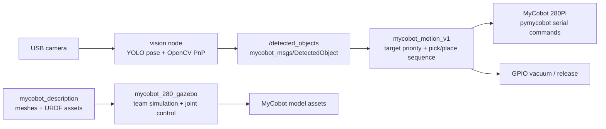

# MyCobot 280Pi ROS 2 Pick-and-Place Lab Migration


ROS 2 workspace for a master's semester project that migrated a UR10-based robotics lab workflow to an Elephant Robotics MyCobot 280Pi platform. The repository includes a team-built Gazebo simulation/joint-control foundation, custom hardware-control experiments, and a vision-driven pick-and-place pipeline for detecting, localizing, picking, and sorting colored cubes.

This was a six-student group project. Building the Gazebo simulation package and implementing joint control in simulation were shared tasks across the student team. My primary individual contribution was the pick-and-place application: YOLO/OpenCV cube detection, PnP pose estimation, Z calibration, ROS 2 publishing, motion-node integration, vacuum pick handling, color-based bin sorting, and stack-height priority.

## Project Snapshot

- Platform: MyCobot 280Pi, Raspberry Pi GPIO vacuum tooling, USB camera
- Middleware: ROS 2 Jazzy on Ubuntu 24.04
- Simulation: team-developed Gazebo package, RViz2-ready URDF assets, ros2_control controllers
- Vision: YOLO pose model, OpenCV `solvePnP`, calibrated camera-to-robot transform
- Task: detect colored cubes, estimate pose, choose a target, pick with vacuum, sort into color bins

## System Architecture



## Repository Layout

```text
.
|-- docs/                 # project overview, setup, simulation, pick-and-place notes
|-- docs/report/          # cleaned public report artifact
|-- media/demo/           # demo clips and result media
|-- src/                  # ROS 2 packages built with colcon
|   |-- mycobot_280_gazebo
|   |-- mycobot_description
|   |-- mycobot_msgs
|   |-- vision
|   |-- mycobot_motion_v1
|   `-- mycobot_control
`-- README.md
```

## My Contribution

I worked mainly on the vision-driven pick-and-place part of the project:

- Built the cube-detection pipeline around YOLO pose inference and OpenCV image processing.
- Used cube keypoints with `solvePnP` to estimate object pose from camera images.
- Added a Z calibration flow to improve height estimates for stacked cubes.
- Published detected object poses and colors through custom ROS 2 messages.
- Integrated detections with a motion node that filters workspace bounds and prioritizes targets.
- Implemented color-based bin sorting and stack-height priority logic.
- Connected the motion flow to a vacuum pick/release sequence on the MyCobot 280Pi setup.

The Gazebo simulation package and joint control in simulation were team tasks. Other project members also contributed to hardware-control nodes, serial communication, kinematics work, and lab migration material.

## Setup: ROS 2 Jazzy

Install ROS 2 Jazzy and common build dependencies:

```bash
sudo apt update
sudo apt install ros-jazzy-desktop python3-colcon-common-extensions
sudo apt install ros-jazzy-ros-gz ros-jazzy-ros2-control ros-jazzy-ros2-controllers
```

Build the workspace:

```bash
source /opt/ros/jazzy/setup.bash
colcon build --symlink-install
source install/setup.bash
```

For the vision package, use a separate Python environment and install the pinned dependencies listed in [docs/setup.md](docs/setup.md). The trained YOLO weights are not committed to Git; pass a local model path at runtime.

## Simulation

Launch the Gazebo model:

```bash
source /opt/ros/jazzy/setup.bash
source install/setup.bash
ros2 launch mycobot_280_gazebo mycobot_280_gazebo.launch.py
```

Launch the fuller Gazebo/controller workflow:

```bash
ros2 launch mycobot_280_gazebo mycobot_280_world.launch.py
```

The `mycobot_description` package contains the mesh assets referenced by the Gazebo URDF. More details are in [docs/simulation.md](docs/simulation.md).

## Hardware Control

The `mycobot_control` package contains group hardware-control experiments for the MyCobot 280Pi, including serial communication, joint velocity/position control, end-effector pose control, and kinematics utilities.

Example launch:

```bash
source install/setup.bash
ros2 launch mycobot_control mycobot_control.launch.py
```

Hardware runs should be performed only after checking serial-port permissions, GPIO wiring, power state, workspace clearance, and emergency-stop behavior.

## Pick-and-Place

Run the vision node with a local YOLO pose model:

```bash
source /opt/ros/jazzy/setup.bash
source install/setup.bash
ros2 run vision vision_node --ros-args -p model_path:=<path-to-model>/best.pt
```

Run the motion node on the robot:

```bash
ros2 run mycobot_motion_v1 motion_node
```

The vision node publishes:

```text
/detected_objects  mycobot_msgs/msg/DetectedObject
```

See [docs/pick_and_place.md](docs/pick_and_place.md) for pipeline details and calibration notes.

## Demo

Current demo artifacts:

- Pick-and-place result snippet: [media/demo/pick_&_place.png](media/demo/pick_&_place.png)
- Gazebo scripts demo: [media/demo/gazebo_scripts_demo.mp4](media/demo/gazebo_scripts_demo.mp4)
- Gazebo/MoveIt demo: [media/demo/gazebo_moveit_demo.mp4](media/demo/gazebo_moveit_demo.mp4)
- Public report PDF: [docs/report/MyCobot_280Pi_Report.pdf](docs/report/MyCobot_280Pi_Report.pdf)

## Limitations And Future Work

- YOLO model weights are excluded from Git. 
- Some hardware parameters are currently constants in code. 
- Final validation should be run on Ubuntu 24.04 with ROS 2 Jazzy using `colcon build --symlink-install`.

## Documentation

- [Project overview](docs/project_overview.md)
- [Setup](docs/setup.md)
- [Simulation](docs/simulation.md)
- [Pick-and-place](docs/pick_and_place.md)
- [Attribution](ATTRIBUTION.md)
